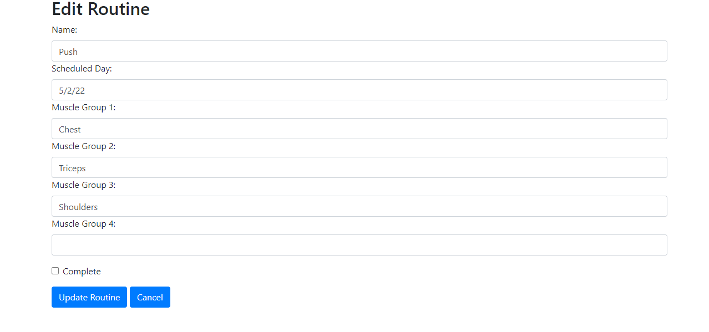
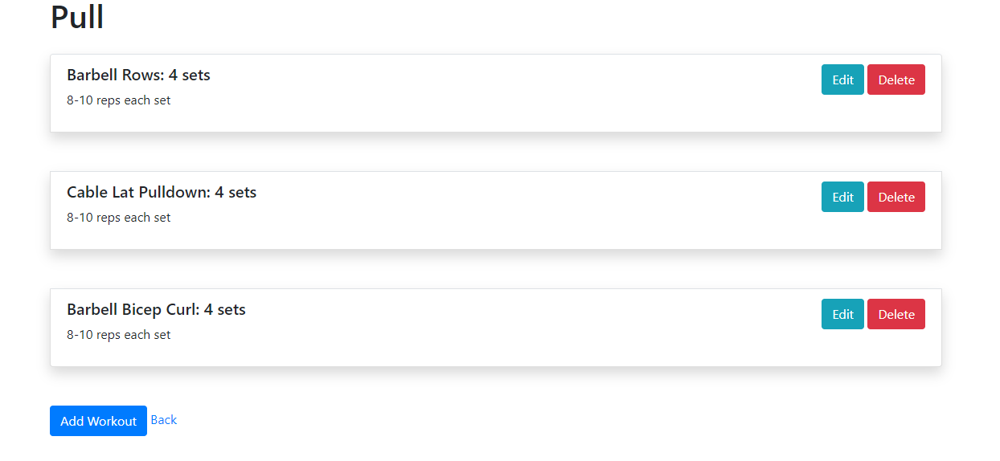

# Every-Set
A workout app to schedule and track workouts

## Link
https://every-set.herokuapp.com/

## Description
Every Set is a CRUD app that I created in order to schedule workouts and track completion. Users are able to
create Routines for a scheduled date, name the routine and specify the muscle groups they would like to target
in the routine. Once you have the Routine created you can add different workouts into the routine and specify
the amount of sets that you have to do of each workout and how many reps are in each set. When you view or edit
the workout you can see what muscles the individual workouts are targeting. Once you are done with a routine you 
can mark it as complete and keep it in the database in order to view for future reference or you can remove the 
routine along with the workouts from your list.

## Code overview
- The App utilizes Handlebars for views and express for routing.
- All aspects of CRUD are present with GET routes for viewing each page and POST, PUT and DELETE routes for each Schema
- There are 2 schema present, Routine Schema and Workout Schema with there being a One-to-Many relationship between the two
- Workouts are dependent upon the Routine and cannot exist without one connected to it

## Screenshots and code snippets

## Home Page-
The home page features the list of routines you have added to the database and the day/date they are scheduled
along with buttons to edit and delete the routines and a button to Add new routines


## Add Routine Form-
The page includes a form to add the routines. This looks exactly like the Edit page except for without values


## Workout index page
This page includes an index of the workouts in the individual Routines the user has created featuring a button 
by each workout to edit and delete along with a Add workout button and a back button that goes back to the routines
I was able to use the async and await functionality to add multiple json objects into the render function. by using
these I was able to take the data from two different Find functions and put them into one object that I referenced in HBS
```bash
router.route('/:id/workouts')
.get(async(req,res) =>{
    const id = req.params.id
    
    let routine = await Routine.find({_id:id})
    let workouts = await Workout.find({routineId:id})
    let context = { 
        routine: routine,
        workouts: workouts
    }
    
        res.render('workouts/view-routine-workouts',context)
        console.log(id)//like this
        console.log(context)

```



## Create and Edit workouts
the forms for creating and editing workouts look basically the same minus the values of the inputs


## Future goals- 
Some of the future goals for the App include:
- Styling in order to give it a notebook type of look for users to feel like they are just writing in a workout 
notebook but in app form. I have tracked my workouts with pen and paper for the longest time and feel it is nice to keep the same look and feel of pen and paper but in the convenience of using your phone.
- Add a way to copy a routine and its workouts to a new item and update the date
- Add a database of workouts filtered by Muscle group and Equipment with descriptions of workouts and pictures to show form which will help you build routines
- Create another router that will act as a Calorie tracker as well in order to create an all-purpose fitness app
- Create a form that allows you to put notes for the workouts to say how it went and possibly track each set


